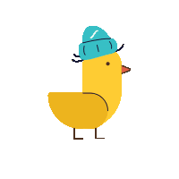
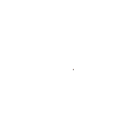
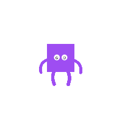

[](CODE_OF_CONDUCT.md)


<p align="center">
  
</p>

<h1 align="center">dotLottie Web</h1>

<p align="center">
  Official LottieFiles players for running <a href="https://dotlottie.io/">.lottie</a> and Lottie animations on the web.<br />
  A core canvas/WASM renderer with framework wrappers for React, Vue, Svelte, Solid, and Web Components.
</p>

<div align="center">
  

  

  

  
</div>

# Packages

| Package                                                        | Description                                                            |
| -------------------------------------------------------------- | ---------------------------------------------------------------------- |
| **[@lottiefiles/dotlottie-web](packages/web/README.md)**       | Core player — canvas rendering with WASM, works in browser and Node.js |
| **[@lottiefiles/dotlottie-react](packages/react/README.md)**   | React component                                                        |
| **[@lottiefiles/dotlottie-vue](packages/vue/README.md)**       | Vue component                                                          |
| **[@lottiefiles/dotlottie-svelte](packages/svelte/README.md)** | Svelte component                                                       |
| **[@lottiefiles/dotlottie-solid](packages/solid/README.md)**   | Solid component                                                        |
| **[@lottiefiles/dotlottie-wc](packages/wc/README.md)**         | Web Component                                                          |

Each package README has full API documentation and usage examples.

## Quick Start

Install the core package or a framework wrapper:

```bash
# Core
npm install @lottiefiles/dotlottie-web

# React
npm install @lottiefiles/dotlottie-react

# Vue
npm install @lottiefiles/dotlottie-vue

# Svelte
npm install @lottiefiles/dotlottie-svelte

# Solid
npm install @lottiefiles/dotlottie-solid

# Web Component
npm install @lottiefiles/dotlottie-wc
```

```js
import { DotLottie } from '@lottiefiles/dotlottie-web';

const dotLottie = new DotLottie({
  canvas: document.getElementById('canvas'),
  src: 'https://your-animation-url.lottie',
  autoplay: true,
  loop: true,
});
```

## Live Examples

**[@lottiefiles/dotlottie-web](packages/web/README.md)**
 [Getting Started](https://codepen.io/lottiefiles/pen/JjzJZmL)
· [Playback Controls](https://codepen.io/lottiefiles/pen/dyrRKwg)
· [Dynamic Loading](https://codepen.io/lottiefiles/pen/JjzJZgB)
· [Multi Animations](https://codepen.io/lottiefiles/pen/wvOxdRa)
· [Advanced Layout](https://codepen.io/lottiefiles/pen/LYvZveR)
· [Named Markers](https://codepen.io/lottiefiles/pen/RwOROKp)
· [Theming](https://codepen.io/lottiefiles/pen/BaEzEeq)

**[@lottiefiles/dotlottie-react](packages/react/README.md)**
 [Getting Started](https://codepen.io/lottiefiles/pen/vYPJpBN)
· [Custom Controls](https://codepen.io/lottiefiles/pen/WNmEdxd)

**[@lottiefiles/dotlottie-vue](packages/vue/README.md)**
 [Getting Started](https://codepen.io/lottiefiles/pen/yLwgeoJ)

## Viewer

The [dotLottie Viewer](https://lottiefiles.github.io/dotlottie-web/) is a hosted tool for testing and debugging animations:

| Page            | Description                                                        |
| --------------- | ------------------------------------------------------------------ |
| **Home**        | Drop a `.lottie` or `.json` file to preview playback and rendering |
| **Playground**  | Experiment with player configuration and animation controls        |
| **Performance** | Benchmark rendering performance across animations                  |

Source: [`apps/viewer/`](apps/viewer/)

## Local Examples

Example apps in [`examples/`](examples/):

| Example                        | Package                                  |
| ------------------------------ | ---------------------------------------- |
| [web](examples/web/)           | `@lottiefiles/dotlottie-web`             |
| [web-node](examples/web-node/) | `@lottiefiles/dotlottie-web` (Node.js)   |
| [react](examples/react/)       | `@lottiefiles/dotlottie-react`           |
| [vue](examples/vue/)           | `@lottiefiles/dotlottie-vue`             |
| [solid](examples/solid/)       | `@lottiefiles/dotlottie-solid`           |
| [wc](examples/wc/)             | `@lottiefiles/dotlottie-wc`              |
| [next](examples/next/)         | `@lottiefiles/dotlottie-react` (Next.js) |

```bash
pnpm install && pnpm run build
cd examples/web
pnpm run dev
```

## Development

**Prerequisites:** Node.js 22+, pnpm 10+

```bash
git clone https://github.com/LottieFiles/dotlottie-web.git
cd dotlottie-web
pnpm install
pnpm run build    # Build all packages
pnpm run dev      # Watch mode
pnpm run test     # Run tests
pnpm run lint     # Lint
pnpm run format   # Format
```

## Contributing

See [Contributing Guidelines](CONTRIBUTING.md) and [Code of Conduct](CODE_OF_CONDUCT.md).

## License

[MIT](LICENSE) © [LottieFiles](https://www.lottiefiles.com)
