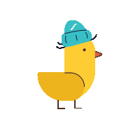
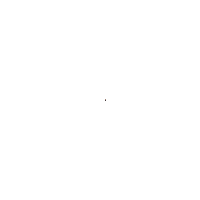
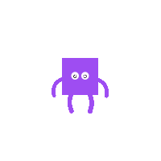
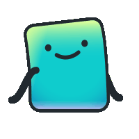

<p align="center">
  
</p>

<h1 align="center">dotLottie Web</h1>

<p align="center">
  The official LottieFiles player for <b>Lottie</b> (<code>.json</code>) and
  <b>dotLottie</b> (<code>.lottie</code>) animations on the web — a Rust + WASM core
  powered by <a href="https://github.com/thorvg/thorvg">ThorVG</a>, with Software,
  WebGL2, and WebGPU rendering backends and full
  <a href="https://dotlottie.io/">dotLottie v2</a> support (theming, state machines,
  and audio).
</p>

<p align="center">
  <a href="https://lottiefiles.github.io/dotlottie-web/"><b>🌐 Live Viewer</b></a> ·
  <a href="https://lottiefiles.github.io/dotlottie-web/perf-test"><b>📊 Perf Playground</b></a> ·
  <a href="https://developers.lottiefiles.com/docs/dotlottie-player/dotlottie-web/"><b>📚 Docs</b></a> ·
  <a href="https://github.com/LottieFiles/dotlottie-rs"><b>🦀 dotLottie-rs</b></a>
</p>

<div align="center">
  

  

  

  
</div>

# Why dotLottie Web

* 📦 **Lottie + dotLottie, one player** — point `src` at a classic Lottie [`.json`](https://lottiefiles.github.io/lottie-docs/) or a [`.lottie`](https://dotlottie.io/) archive. The `.lottie` format bundles multiple animations, themes, state machines, and embedded assets into a single compressed file.
* 🦀 **Rust + WASM core** — powered by [`dotlottie-rs`](https://github.com/LottieFiles/dotlottie-rs), the same engine that ships in iOS, Android, and native dotLottie players. One battle-tested implementation across every platform.
* 🎨 **ThorVG renderer** — an industrial-grade vector graphics engine with the broadest Lottie feature coverage of any web renderer. See the [ThorVG Lottie support matrix](https://github.com/thorvg/thorvg/wiki/Lottie-Support).
* ⚡ **Three rendering backends** — Software (Canvas2D), WebGL2, and WebGPU (experimental). Switch with a one-line import change — same `DotLottie` class everywhere.
* 📁 **dotLottie v2 ready** — first-class **theming**, interactive **state machines**, and **audio** in a single `.lottie` file. No userland wiring required.
* 🧵 **Off-main-thread** — `DotLottieWorker` renders on a Web Worker with `OffscreenCanvas`, keeping your UI buttery-smooth even with dozens of animations.
* ⚛️ **6 first-party SDKs** — Vanilla JS, [React](packages/react/README.md), [Vue](packages/vue/README.md), [Svelte](packages/svelte/README.md), [Solid](packages/solid/README.md), and a [Web Component](packages/wc/README.md). Plus SSR-safe (Next.js example included) and Node.js 18+ support.
* 🎛️ **Rich runtime control** — themes, slots (color/scalar/vector/gradient/text/image), markers, segments, layouts (`fit` + `align`), playback modes (forward/reverse/bounce), frame interpolation, 25+ typed events.

## Quick Start

Install the package for your framework, then drop in a few lines. The same player loads both Lottie `.json` and dotLottie `.lottie` files — just point `src` at either:

### Vanilla JS

```bash
npm install @lottiefiles/dotlottie-web
```

```html
<canvas id="canvas" style="width: 300px; height: 300px"></canvas>
```

```js
import { DotLottie } from '@lottiefiles/dotlottie-web';

const dotLottie = new DotLottie({
  canvas: document.getElementById('canvas'),
  src: 'https://your-animation-url.lottie',
  autoplay: true,
  loop: true,
});
```

<details>
  <summary><b>⚛️ React</b></summary>

  ```bash
  npm install @lottiefiles/dotlottie-react
  ```

  ```jsx
  import { DotLottieReact } from '@lottiefiles/dotlottie-react';

  const App = () => (
    <DotLottieReact
      src="path/to/animation.lottie"
      loop
      autoplay
    />
  );
  ```
</details>

<details>
  <summary><b>💚 Vue</b></summary>

  ```bash
  npm install @lottiefiles/dotlottie-vue
  ```

  ```vue
  <script setup>
  import { DotLottieVue } from '@lottiefiles/dotlottie-vue';
  </script>

  <template>
    <DotLottieVue
      style="height: 500px; width: 500px"
      autoplay
      loop
      src="https://path-to-lottie.lottie"
    />
  </template>
  ```
</details>

<details>
  <summary><b>🧡 Svelte</b></summary>

  ```bash
  npm install @lottiefiles/dotlottie-svelte
  ```

  ```svelte
  <script lang="ts">
    import { DotLottieSvelte } from '@lottiefiles/dotlottie-svelte';
  </script>

  <DotLottieSvelte src="path/to/animation.lottie" loop autoplay />
  ```
</details>

<details>
  <summary><b>🔵 Solid</b></summary>

  ```bash
  npm install @lottiefiles/dotlottie-solid
  ```

  ```jsx
  import { DotLottieSolid } from '@lottiefiles/dotlottie-solid';

  const App = () => (
    <DotLottieSolid
      src="path/to/animation.lottie"
      loop
      autoplay
    />
  );
  ```
</details>

<details>
  <summary><b>🌐 Web Component (drop-in, no build step)</b></summary>

  ```html
  <dotlottie-wc
    src="https://lottie.host/4db68bbd-31f6-4cd8-84eb-189de081159a/IGmMCqhzpt.lottie"
    autoplay
    loop
  ></dotlottie-wc>

  <script
    type="module"
    src="https://unpkg.com/@lottiefiles/dotlottie-wc@latest/dist/dotlottie-wc.js"
  ></script>
  ```

  Or via npm:

  ```bash
  npm install @lottiefiles/dotlottie-wc
  ```

  ```js
  import '@lottiefiles/dotlottie-wc';
  ```
</details>

## Features

### 🤖 Interactive State Machines

dotLottie v2 ships **state machines** built into the file format — no JS glue required. Define states, transitions, and inputs in a single `.lottie` and drive them at runtime through pointer events, custom events, or input values.

```js
const dotLottie = new DotLottie({
  canvas: document.getElementById('canvas'),
  src: 'interactive-button.lottie',
  stateMachineId: 'main',
  autoplay: true,
});
```

The player exposes typed events for `stateMachineStart`, `stateMachineTransition`, `stateMachineStateEntered`, custom events, and input changes — perfect for wiring animations into your UI logic.

### 🎨 Runtime Theming

Switch palettes, animate gradients, swap text, or replace images at runtime — without re-exporting from After Effects. Themes can be embedded in the `.lottie` manifest or supplied programmatically.

```js
// Use a theme defined in the .lottie manifest
dotLottie.setTheme('dark');

// Or supply a theme object at runtime
dotLottie.setThemeData({
  rules: [
    { id: 'primary', type: 'Color', value: [0.9, 0.2, 0.4, 1.0] },
  ],
});
```

The full `Theme` type covers color, scalar, position, vector, gradient, image, and text rules — all keyframe-aware.

### 🔊 Audio Support

`dotLottie` files can carry embedded audio tracks alongside the animation timeline — handy for UI sound effects, onboarding flows, or interactive characters. Audio is decoded and played in lockstep with the animation timeline.

> Audio is an experimental feature in `dotlottie-rs`. Browser autoplay policies still apply — initiate playback from a user gesture.

### 🧵 Off-Main-Thread Rendering

For pages with many animations, swap `DotLottie` for `DotLottieWorker`. Identical API, but rendering happens on a Web Worker with an `OffscreenCanvas`, freeing the main thread for layout, scrolling, and your app code.

```js
import { DotLottieWorker } from '@lottiefiles/dotlottie-web';

const player = new DotLottieWorker({
  canvas: document.getElementById('canvas'),
  src: 'animation.lottie',
  autoplay: true,
  loop: true,
  workerId: 'shared-pool', // optional: share one worker across many instances
});
```

All `DotLottieWorker` methods are async (Promise-returning) since they cross a worker boundary.

### ⚡ Hardware-Accelerated Rendering

The default Software backend works everywhere. For demanding workloads — many concurrent animations, large canvases, complex masks — opt in to GPU rendering via subpath imports:

```js
// WebGL2 — broadly supported
import { DotLottie } from '@lottiefiles/dotlottie-web/webgl';

// WebGPU — experimental, modern Chromium / Safari TP
import { DotLottie } from '@lottiefiles/dotlottie-web/webgpu';
```

The class name (`DotLottie`) and API surface are identical across all three backends, so swapping renderers is a one-line change. Each backend ships its own optimized WASM build via [package.json conditional exports](packages/web/package.json).

> Want to see the difference on your own hardware? The hosted [perf-test page](https://lottiefiles.github.io/dotlottie-web/perf-test) compares Software vs WebGL vs WebGPU vs Skottie/CanvasKit head-to-head.

### 🖼️ More built-in capabilities

* **Multi-animation `.lottie` files** — `animationId` config + `loadAnimation(id)` to switch between bundled animations
* **Named markers** — `setMarker(name)` and `markers()` to play AE-defined segments
* **Frame segments** — `setSegment(start, end)` for arbitrary frame ranges
* **Layout** — `fit` (`contain` / `cover` / `fill` / `fit-width` / `fit-height` / `none`) + normalized `align: [x, y]`
* **Slots** — bind dynamic data to color, scalar, vector, gradient, text, and image slots at runtime
* **Playback modes** — `forward` / `reverse` / `bounce` / `reverse-bounce` with configurable loop counts
* **Frame interpolation** — smooth subframe playback (default on) or pinned to the original AE frame rate
* **Freeze on offscreen** — automatically pause rendering when the canvas leaves the viewport
* **25+ typed events** — `play`, `pause`, `frame`, `complete`, `loop`, `load`, `loadError`, `freeze`, plus the full state-machine event suite

## Packages

All packages render both Lottie (`.json`) and dotLottie (`.lottie`) animations.

| Package                                                        | Description                                                                                             |
| -------------------------------------------------------------- | ------------------------------------------------------------------------------------------------------- |
| **[@lottiefiles/dotlottie-web](packages/web/README.md)**       | Core Lottie & dotLottie player — Rust/WASM via dotlottie-rs, Canvas2D / WebGL / WebGPU, Node-isomorphic |
| **[@lottiefiles/dotlottie-react](packages/react/README.md)**   | React component for Lottie & dotLottie                                                                  |
| **[@lottiefiles/dotlottie-vue](packages/vue/README.md)**       | Vue 3 component for Lottie & dotLottie                                                                  |
| **[@lottiefiles/dotlottie-svelte](packages/svelte/README.md)** | Svelte component for Lottie & dotLottie                                                                 |
| **[@lottiefiles/dotlottie-solid](packages/solid/README.md)**   | Solid component for Lottie & dotLottie                                                                  |
| **[@lottiefiles/dotlottie-wc](packages/wc/README.md)**         | Framework-agnostic Web Component for Lottie & dotLottie                                                 |

Each package README contains its full API reference, prop tables, and event documentation.

## dotLottie Viewer

A hosted companion app at **[lottiefiles.github.io/dotlottie-web](https://lottiefiles.github.io/dotlottie-web/)** for inspecting, debugging, and benchmarking animations:

| Page                                                                     | What it does                                                                                                                                                  |
| ------------------------------------------------------------------------ | ------------------------------------------------------------------------------------------------------------------------------------------------------------- |
| [**Home**](https://lottiefiles.github.io/dotlottie-web/)                 | Drop a `.lottie` or `.json` file to preview rendering and inspect manifest details                                                                            |
| [**Playground**](https://lottiefiles.github.io/dotlottie-web/playground) | Interactive editor for player config, themes, markers, and animation switching                                                                                |
| [**Performance**](https://lottiefiles.github.io/dotlottie-web/perf-test) | Stress test across 40+ animations — **compare Software / WebGL / WebGPU / Skottie head-to-head on your own hardware**, with seedable runs for reproducibility |
| [**List**](https://lottiefiles.github.io/dotlottie-web/list)             | Gallery of curated animations                                                                                                                                 |
| [**Embed**](https://lottiefiles.github.io/dotlottie-web/embed)           | Embedding patterns and demos                                                                                                                                  |

Source: [`apps/viewer/`](apps/viewer/).

## Live Examples (CodePen)

**[@lottiefiles/dotlottie-web](packages/web/README.md)** —
[Getting Started](https://codepen.io/lottiefiles/pen/JjzJZmL) ·
[Playback Controls](https://codepen.io/lottiefiles/pen/dyrRKwg) ·
[Dynamic Loading](https://codepen.io/lottiefiles/pen/JjzJZgB) ·
[Worker](https://codepen.io/lottiefiles/pen/VwJZPrQ) ·
[Multi Animations](https://codepen.io/lottiefiles/pen/wvOxdRa) ·
[Advanced Layout](https://codepen.io/lottiefiles/pen/LYvZveR) ·
[Named Markers](https://codepen.io/lottiefiles/pen/RwOROKp) ·
[Theming](https://codepen.io/lottiefiles/pen/BaEzEeq) ·
[Interactivity](https://codepen.io/lottiefiles/pen/VwJvdRN)

**[@lottiefiles/dotlottie-react](packages/react/README.md)** —
[Getting Started](https://codepen.io/lottiefiles/pen/vYPJpBN) ·
[Custom Controls](https://codepen.io/lottiefiles/pen/WNmEdxd)

**[@lottiefiles/dotlottie-vue](packages/vue/README.md)** —
[Getting Started](https://codepen.io/lottiefiles/pen/yLwgeoJ)

## Local Examples

Runnable example apps in [`examples/`](examples/):

| Example                        | Package                                  | Highlights                                    |
| ------------------------------ | ---------------------------------------- | --------------------------------------------- |
| [web](examples/web/)           | `@lottiefiles/dotlottie-web`             | State machines, themes, segments, layout      |
| [web-node](examples/web-node/) | `@lottiefiles/dotlottie-web` (Node.js)   | Server-side rendering to a buffer             |
| [react](examples/react/)       | `@lottiefiles/dotlottie-react`           | Renderer selection (canvas/webgl/webgpu)      |
| [vue](examples/vue/)           | `@lottiefiles/dotlottie-vue`             | Theme toggling, ref/event patterns            |
| [solid](examples/solid/)       | `@lottiefiles/dotlottie-solid`           | Signal-based state, theme/animation switching |
| [wc](examples/wc/)             | `@lottiefiles/dotlottie-wc`              | Web Component usage and event delegation      |
| [next](examples/next/)         | `@lottiefiles/dotlottie-react` (Next.js) | SSR-safe rendering with the App Router        |

```bash
pnpm install && pnpm run build
cd examples/web
pnpm run dev
```

## Browser & Runtime Support

**Required:** WebAssembly · Canvas 2D · Fetch API
**Optional (enhances perf):** Web Workers · OffscreenCanvas · WebGL2 (for `/webgl`) · WebGPU (for `/webgpu`)

| Browser    | Minimum version |
| ---------- | --------------- |
| Chrome     | 57+ (Mar 2017)  |
| Firefox    | 52+ (Mar 2017)  |
| Safari     | 11+ (Sep 2017)  |
| Edge       | 16+ (Oct 2017)  |
| iOS Safari | 11+ (Sep 2017)  |

**Node.js:** 18+ — `@lottiefiles/dotlottie-web` is isomorphic and runs server-side for thumbnail generation, frame extraction, or static rendering.

## Development

**Prerequisites:** Node.js 22+, pnpm 10+

```bash
git clone https://github.com/LottieFiles/dotlottie-web.git
cd dotlottie-web
pnpm install
pnpm run build    # Build all packages
pnpm run dev      # Watch mode
pnpm run test     # Run tests
pnpm run lint     # Lint
pnpm run format   # Format
```

## Contributing

Contributions are welcome! Read the [Contributing Guidelines](CONTRIBUTING.md) and [Code of Conduct](CODE_OF_CONDUCT.md) before opening an issue or PR.

## License

[MIT](LICENSE) © [LottieFiles](https://www.lottiefiles.com)
